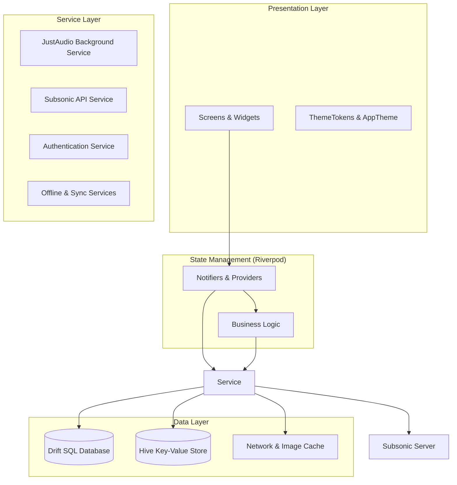
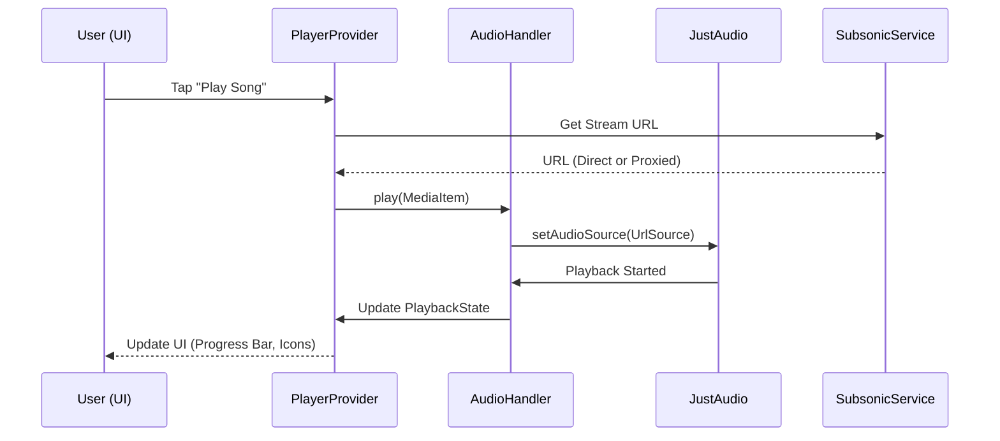
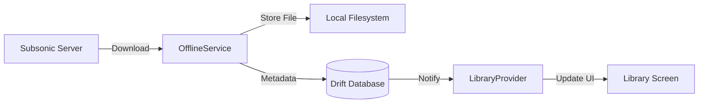
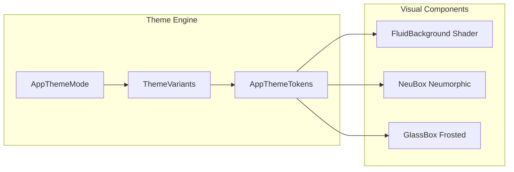
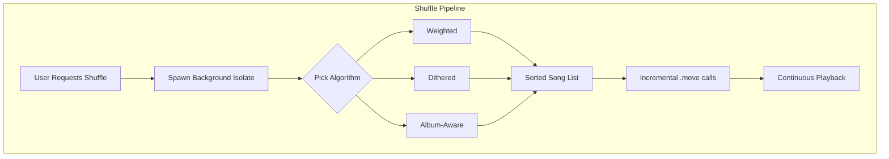
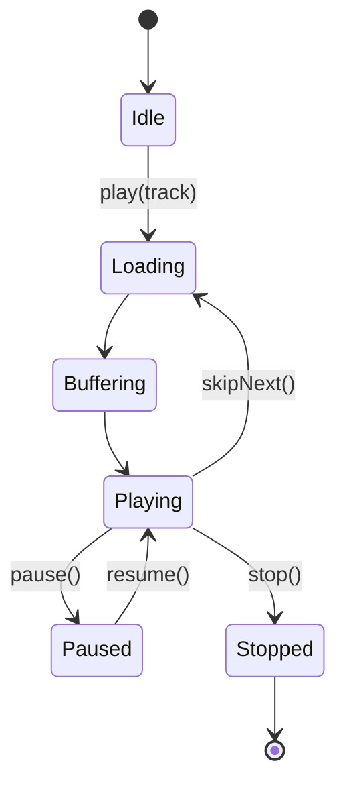

# Project Architecture: NaviVibe

NaviVibe is a high-performance, aesthetically pleasing music player built with Flutter, primarily designed for Subsonic-compatible servers. This document outlines the technical architecture, data flow, and key components of the application.

## 🏗️ High-Level Architecture

The project follows a **Layered Clean Architecture** pattern, ensuring a separation of concerns between UI, business logic, and data handling. State management is powered by **Riverpod** with code generation for safety and performance.

---

## 📦 Component Breakdown

### 1. Presentation Layer (`lib/screens`, `lib/widgets`)
- **Screens**: Functional pages like `HomeScreen`, `NowPlayingScreen`, and `LibraryScreen`.
- **Widgets**: Atomic, reusable components (e.g., `FluidBackground`, `AppScaffold`).
- **Aesthetics**: Uses a custom `ThemeTokens` system for dynamic, premium UI transitions and GPU-accelerated shaders for background animations.

### 2. State Management Layer (`lib/providers`)
- Uses **Riverpod 2.0** with `@riverpod` annotations.
- **PlayerProvider**: Manages the playback state, queue, and interaction with the audio handler.
- **LibraryProvider**: Handles local/remote music metadata and playlist management.
- **SettingsProvider**: Manages user preferences and server configuration.

### 3. Service Layer (`lib/services`)
- **AudioHandler**: Extends `BaseAudioHandler` to manage background playback, media notifications, and lock-screen controls via `just_audio`.
- **SubsonicService**: The bridge to the backend server, handling authentication and data fetching.
- **OfflineService**: Manages track downloads and local playback logic.

### 4. Data Layer (`lib/database`, `lib/models`)
- **Drift (SQLite)**: Used for complex relational data like library metadata, search history, and listening stats.
- **Hive**: High-speed NoSQL storage for settings, auth tokens, and UI state.
- **Models**: Immutable data classes (generated via `freezed` or similar) representing Songs, Albums, and Artists.

---

## 🔄 Core Data Flows

### A. Music Playback Flow
This diagram illustrates how a user action in the UI travels through the system to produce sound.

### B. Offline Sync Flow
How tracks are moved from the server to local storage for offline use.

---

## 🎨 Design System & Aesthetics

NaviVibe uses a unique **Multi-Engine Theme System** that allows users to switch between drastically different visual styles without changing the underlying logic.

### Theme Modes
- **Spotify**: Classic dark palette with green accents.
- **Aura**: Dynamic mesh gradients driven by album art (GPU-accelerated).
- **Frost**: iOS-style glassmorphism with frosted effects.
- **Neumorphic**: Tactile soft-UI with extruded surfaces.
- **Analog**: Warm retro vinyl aesthetic (cream, wood, brushed metal).
- **Zen**: Stark typography-led minimalism.

---

## 🔊 Audio Engine Details

The audio system is built on `just_audio` and `audio_service`, ensuring high-quality playback and system-level integration.

---

## 🔊 Audio Engine & Shuffle Intelligence

The audio engine is a high-performance system built to handle large queues (1000+ tracks) with zero UI lag and professional-grade playback features.

### 🚀 Gapless Reordering (The "Shuffle-Gap" Fix)
Unlike most players that rebuild the entire playback pipeline during a shuffle (causing a ~1s silence), NaviVibe uses **Incremental In-Place Reordering**.
- It leverages `ConcatenatingAudioSource.move()` to shift tracks while the decoder is running.
- The currently playing track is treated as an "anchor," ensuring that audio never stops, even when the rest of the queue is being randomized.

### 🧠 Advanced Shuffle Algorithms
NaviVibe moves beyond basic randomization with 6 distinct algorithms, all processed in **background isolates** to keep the UI at 120 FPS.

| Algorithm | Logic | Best For... |
| :--- | :--- | :--- |
| **Fisher-Yates** | Standard O(n) uniform random pass. | True randomness. |
| **Dithered Position** | Spreads genres/composers using position scores + random dither. | Avoiding "genre clumps" organically. |
| **Merge-Shuffle** | Optimal interleaving (Ruud van Asseldonk algorithm). | Mathematical guarantee of no back-to-back same-category songs. |
| **Weighted (YouTube)** | Efraimidis-Spirakis trick ($key = r^{1/w}$). | Prioritizing Starred, High-Rated, and Top-Played tracks. |
| **Album-Aware** | Randomizes albums but preserves internal track order. | Hearing a variety of artists without breaking album flow. |
| **Recency-Dampened** | Weighted shuffle with a 10x penalty for recently played songs. | Long sessions where you want to avoid repeat tracks. |

### 🎼 Smart Weighting Formula
Weights for weighted shuffles are calculated dynamically:
$$Weight = \text{Base} \times (2.0 \text{ if Starred}) + \frac{\text{Rating}-1}{4} + \text{PlayCount Bonus}$$

---

## 🏗️ State Machine

---

## 🛠️ Tech Stack

| Category | Technology |
| :--- | :--- |
| **Framework** | Flutter (Dart) |
| **State Management** | Riverpod |
| **Audio Engine** | just_audio + just_audio_background |
| **Local Database** | Drift (SQLite) & Hive |
| **Networking** | Dio & HTTP |
| **UI/Animations** | Fragment Shaders, Flutter Animate, Google Fonts |
| **Backend Support** | Subsonic API (Airsonic, Navidrome, Gonic) |

---

> [!TIP]
> **Performance Note**: The `FluidBackground` uses a custom GLSL fragment shader (`shaders/fluid_background.frag`) to achieve fluid animations with 60x lower CPU cost than standard Flutter painters.
