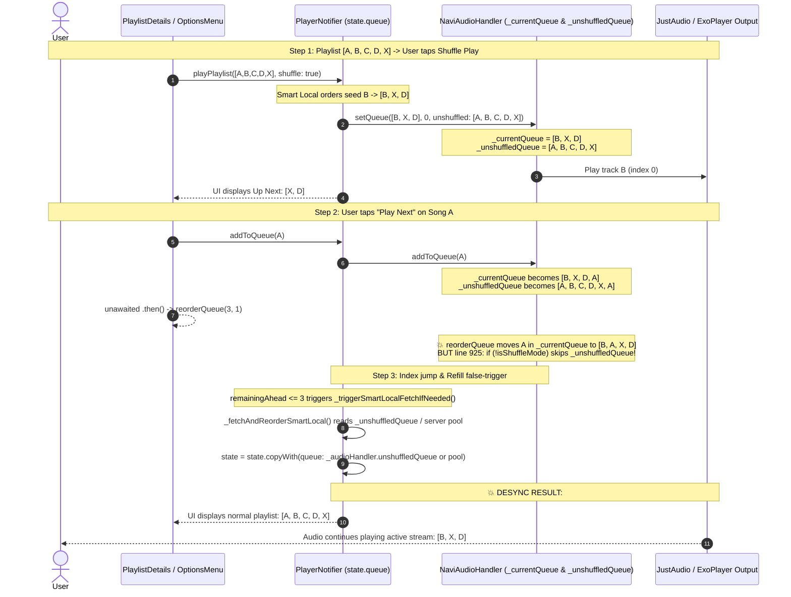

# Audio Queue Architecture & Flaws Investigation Report

**Scope:** Android, iOS, Windows, macOS, and Linux  
**Affected Modules:** `NaviAudioHandler` (`lib/services/navi_audio_handler.dart`), `PlayerNotifier` / `PlayerState` (`lib/providers/player_provider.dart`), `OptionsMenu` (`lib/widgets/options_menu.dart`), `SongTile` (`lib/widgets/song_tile.dart`), `NowPlayingScreen` (`lib/screens/now_playing_screen.dart`), `PlaylistDetailsScreen` (`lib/screens/playlist_details_screen.dart`).

---

## Executive Summary

The audio queue subsystem suffers from three major architectural problems that manifest across both **Desktop (Windows/macOS/Linux)** and **Mobile (Android/iOS)**:

1. **Playback Interruption (2-Second Audio Stoppage) on "Add to Queue" & "Play Next"**:
   - **Desktop**: Adding to the queue triggers an unintended `_rebuildSource()` which re-instantiates `player.setAudioSource()` for the newly added track, cutting off the active track.
   - **Android/iOS**: "Play Next" is implemented as an un-atomic two-step hack (`addToQueue()` followed by an unawaited `reorderQueue()`). For queues over 100 songs (or queues $\le 5$ songs during shuffle updates), `_rebuildSource()` is invoked, destroying ExoPlayer's buffer and reloading network streams.
2. **Visual vs Audio Desync & Queue Reverting to Original Playlist Order (e.g. `[A,B,C,D,X]` vs `[B,X,D]`)**:
   - When playing a shuffled playlist (`[B, X, D]`), `_unshuffledQueue` stores the original list `[A, B, C, D, X]`.
   - Tapping "Play Next" on song `A` triggers the two-step hack (`addToQueue(A)` $\rightarrow$ `reorderQueue()`).
   - `addToQueue(A)` appends `A` to `_currentQueue` and `_unshuffledQueue`.
   - Because `shuffleMode == true`, `reorderQueue()` **refuses to update `_unshuffledQueue`**.
   - Simultaneously, appending to the tail causes `currentIndex` to briefly jump near the end (`remainingAhead <= 3`), triggering **Smart Local Refill / Autoplay** or an unshuffle state refresh.
   - Riverpod's `state.queue` gets overwritten with `_unshuffledQueue` (`[A, B, C, D, X]`) or the server pool, updating the UI visually to the normal playlist order, while the audio player engine continues outputting the active track from `[B, X, D]`.
3. **Mangled Queue & Crash Spirals on Playback Errors**:
   - `_recoverStuckPlayer()` creates an infinite re-entrant loop by repeatedly attempting to reload the broken track that just threw `PlayerException`.
   - On Android, `_recoverStuckPlayer()` stops the player and re-creates sources, causing secondary `seekToNext()` failures.
   - Desynchronized fallback track indices bypass Riverpod state synchronization, leading to out-of-bounds queue slicing in `_prunePlayedSongs()`.

---

## Detailed Scenario: The Playlist Shuffle "Play Next" Desync Bug

### Step-by-Step Breakdown of the User Scenario:



### Why this happens in code:
1. **`setQueue` dual-queue split (`lib/services/navi_audio_handler.dart:352-353`)**:
   When you hit shuffle on playlist `[A, B, C, D, X]`:
   - `_currentQueue` is set to the shuffled list `[B, X, D]`.
   - `_unshuffledQueue` is set to the original playlist `[A, B, C, D, X]`.
2. **`addToQueue(A)` appends to both lists (`lib/services/navi_audio_handler.dart:802-803`)**:
   - `_currentQueue` $\rightarrow$ `[B, X, D, A]`
   - `_unshuffledQueue` $\rightarrow$ `[A, B, C, D, X, A]`
3. **`reorderQueue()` ignores `_unshuffledQueue` in shuffle mode (`lib/services/navi_audio_handler.dart:925-928`)**:
   ```dart
   final song = _currentQueue.removeAt(oldIndex);
   _currentQueue.insert(newIndex, song); // _currentQueue is now [B, A, X, D]

   if (!isShuffleMode) { // 💥 isShuffleMode is TRUE, so _unshuffledQueue is NOT updated!
     final unSong = _unshuffledQueue.removeAt(oldIndex);
     _unshuffledQueue.insert(newIndex, unSong);
   }
   ```
4. **Triggering Pool Refill or State Resync (`lib/providers/player_provider.dart:374-383`)**:
   - Because `addToQueue` momentarily sets the index or loads the track at the tail, `_triggerSmartLocalFetchIfNeeded()` fires.
   - When Smart Local finishes or when state syncs via `state = state.copyWith(queue: ...)`, `state.queue` is updated from the unshuffled pool or `_unshuffledQueue` (`[A, B, C, D, X]`).
   - The UI widget tree watches `playerProvider` and immediately re-renders the list as **`[A, B, C, D, X]`**.
   - But the audio player engine (`player`) was never interrupted with the new list, so it continues playing the audio buffer of **`[B, X, D]`**.

---

## Deep Dive: Problem 1 — Audio Stoppage (2-Second Freeze) on Queue Operations

### 1. Desktop Root Cause (Windows / Linux / macOS)
On desktop platforms, `just_audio_media_kit` does not support playlist manipulation through platform channels. Navi uses a single-track bridge (`_isLinux == true`), where `_playlist` is permanently `null`.

In `lib/services/navi_audio_handler.dart` (lines 801–809):
```dart
Future<void> addToQueue(Song song) async {
  _currentQueue.add(song);
  _unshuffledQueue.add(song);
  if (_playlist != null) {
    await _playlist!.add(_toSource(song));
  } else {
    // 💥 FATAL FLAW: Rebuilds audio player and loads newly appended track!
    await _rebuildSource(_currentQueue.length - 1);
  }
}
```
* Calling `_rebuildSource(_currentQueue.length - 1)` calls `_linuxLoadTrack(...)` on the new track.
* This immediately stops the currently playing song, forces a 2-second buffering pause, and begins playing the newly added song from the end of the queue.
* On desktop, adding to the queue while a song is playing should **only update the in-memory queue list** without touching `setAudioSource`.

### 2. Android & iOS Root Cause (Mobile)
On Android, `just_audio` uses ExoPlayer's `ConcatenatingMediaSource`.

1. **Windowing Rebuild Threshold (`maxConcatSources = 100`)**:
   In `navi_audio_handler.dart` (lines 468–478), when the queue contains more than 100 songs, `_playlistOffset` is set to `startIndex`. When `reorderQueue()` is called for "Play Next":
   ```dart
   if (_playlist != null) {
     if (_playlistOffset == 0) {
       await _playlist!.move(oldIndex, newIndex);
     } else {
       final savedPosition = player.position;
       // 💥 Destroys active ExoPlayer pipeline and re-buffers from network
       await _rebuildSource(
         currentIndex.clamp(0, _currentQueue.length - 1),
         initialPosition: savedPosition,
       );
       if (player.playing) player.play();
     }
   }
   ```
   This triggers a full reload of the audio player engine and network stream, causing a 2-second audio freeze.

2. **Missing First-Class "Insert Next" Primitive**:
   Neither `PlayerNotifier` nor `NaviAudioHandler` exposes an `insertNext(Song song)` or `playNextSong(Song song)` method. UI widgets are forced to perform an un-atomic two-step workaround:
   ```dart
   notifier.addToQueue(song).then((_) {
     final newState = ref.read(playerProvider);
     notifier.reorderQueue(newState.queue.length - 1, insertAt);
   });
   ```
   This generates two independent, racing operations across Riverpod and the native audio player.

---

## Deep Dive: Problem 3 — Error Cascades & Mangled Queue State

### 1. Infinite Re-Entrant Recovery Loop
In `navi_audio_handler.dart` (lines 88–96 and 1188–1224):
- When `PlayerException` is caught, `_recoverStuckPlayer()` stops playback, waits 1 second, and **reloads the exact same failing song index and position**.
- Reloading the corrupt or unavailable stream triggers an immediate second `PlayerException`, spawning concurrent recovery loops.
- When it finally enters the `catch` block to `skipToNext()`, overlapping calls corrupt `_linuxTargetIndex`, `_linuxIndex`, and `_lastKnownIndex`.

### 2. Android ExoPlayer Source Invalidation on Recovery
On Android, `_recoverStuckPlayer()` calls `player.stop()` and `_rebuildSource()`. If `_rebuildSource()` throws, the fallback `skipToNext()` calls `player.seekToNext()`. But because `player.stop()` disposed of the active media source, `seekToNext()` crashes with an unhandled exception, leaving `player.currentIndex` as `null` and breaking all UI bindings.

### 3. Slicing the Wrong Range in `_prunePlayedSongs()`
In `player_provider.dart` (lines 1816–1845):
```dart
unawaited(_audioHandler.pruneRange(0, pruneCount));
final newQueue = List<Song>.from(state.queue)..removeRange(0, pruneCount);
final newIndex = state.currentIndex - pruneCount;
state = state.copyWith(queue: newQueue, currentIndex: newIndex);
```
If `currentIndex` was corrupted or shifted by error-recovery skips without updating Riverpod, `pruneRange(0, pruneCount)` slices away unplayed upcoming songs instead of history.

---

## Architectural Comparison Table

| Feature / Behavior | Desktop (Windows / macOS / Linux) | Android & iOS (Mobile) |
| :--- | :--- | :--- |
| **Player Architecture** | Single-track bridge (`_playlist == null`, 1 track loaded at a time) | `ConcatenatingAudioSource` (up to 100 tracks in ExoPlayer memory) |
| **"Add to Queue" Action** | **Broken**: Calls `_rebuildSource()` which reloads audio and stops playback for 2s | Works if $\le 100$ tracks; breaks index tracking if windowed ($> 100$) |
| **"Play Next" Action** | **Broken**: 2-step hack (`addToQueue` $\rightarrow$ `reorderQueue`) stops music and hijacks `currentIndex` | **Broken**: Triggers timeline reload if windowed or rapid `moveMediaSource` timeline jitter |
| **Shuffle Reorder Sync** | `_unshuffledQueue` desynchronizes; unshuffle/re-shuffle reverts custom order | Same desync bug in `_unshuffledQueue` |
| **Playback Error Recovery** | Infinite recovery loop reloading corrupt track; fallback skips bypass Riverpod sync | `player.stop()` breaks ExoPlayer concatenation; subsequent `seekToNext()` throws |
| **Pruning Under Errors** | Desynced `_linuxIndex` causes `pruneRange` to delete active tracks | Desynced `player.currentIndex` causes `pruneRange` to delete active tracks |

---

## Complete Solution & Implementation Roadmap

### 1. Fix `addToQueue` & `addAllToQueue` in `NaviAudioHandler`
- **Desktop**: If playback is active, strictly mutate `_currentQueue` and `_unshuffledQueue` in memory. Never call `_rebuildSource()`.
- **Empty Queue Edge Case**: Only call `_rebuildSource(0)` if `_currentQueue` was previously empty and the player was stopped.

### 2. Implement Atomic `insertNext(Song song)` / `insertAllNext(List<Song> songs)`
- Add native methods in `NaviAudioHandler` and `PlayerNotifier`.
- Calculate `insertIndex = state.currentIndex + 1`.
- Insert directly into `_currentQueue`, `_unshuffledQueue`, and `_playlist` (via `insert(insertIndex, ...)` on mobile) in a single atomic transaction without re-loading audio sources or triggering index stream cascades.
- Refactor `options_menu.dart` and `song_tile.dart` to call `notifier.insertNext(song)`.

### 3. Synchronize `_unshuffledQueue` on All Mutations
- Ensure that whenever a song is inserted, removed, or reordered, `_unshuffledQueue` is kept consistent regardless of whether `shuffleMode` is true or false.

### 4. Robust Error Recovery & Re-Entrancy Locks
- Add an `_isRecovering` mutex in `NaviAudioHandler`.
- Track failed song IDs with a retry limit (maximum 1 retry).
- When a track fails, immediately skip to `currentIndex + 1`, update both `_linuxTargetIndex` and Riverpod's `state.currentIndex` atomically, and alert the UI with a descriptive notification without entering a recovery loop.
