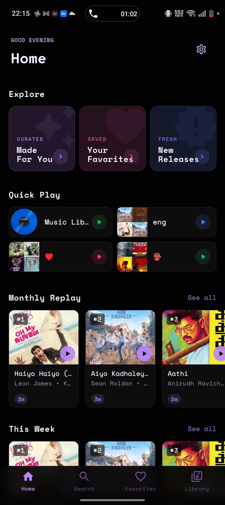
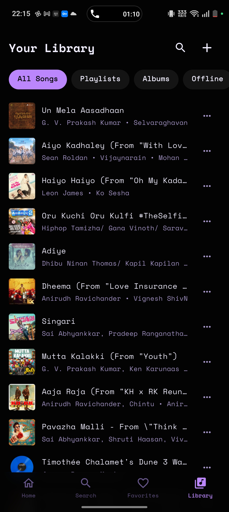
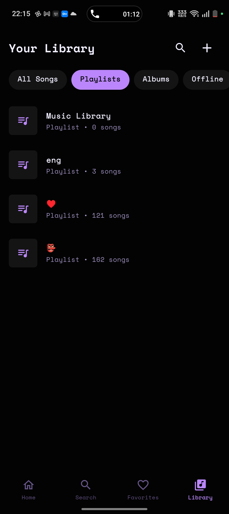
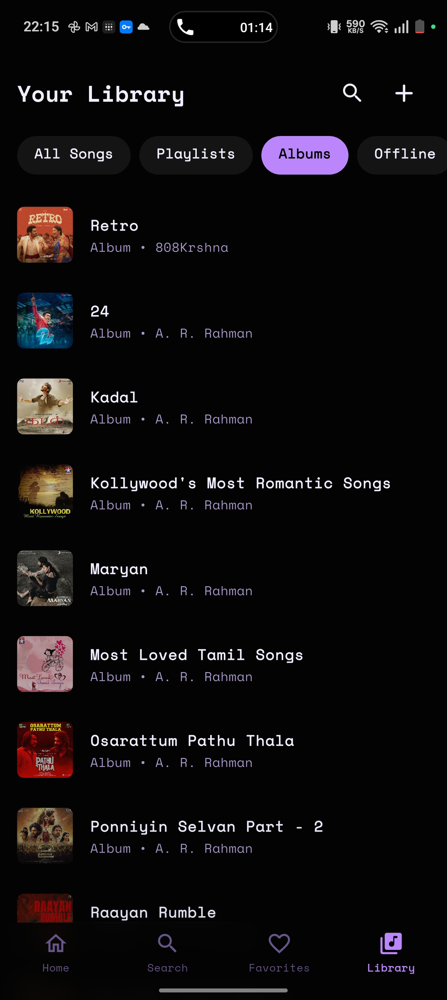
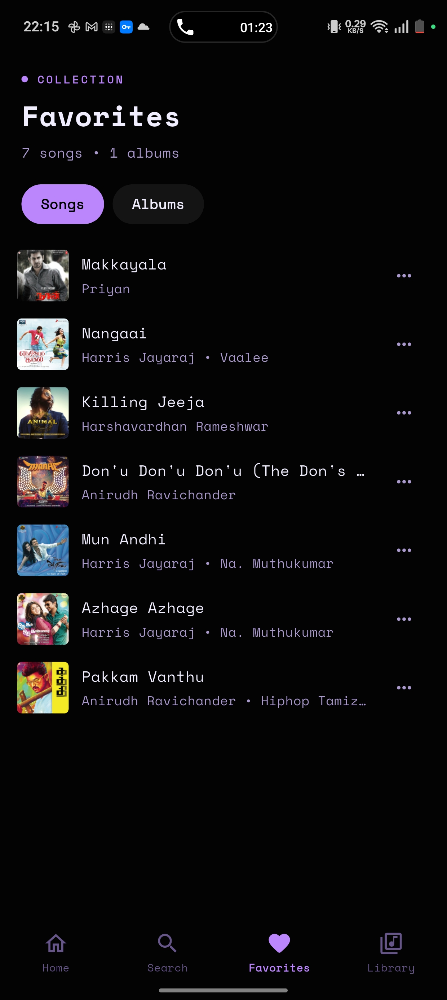
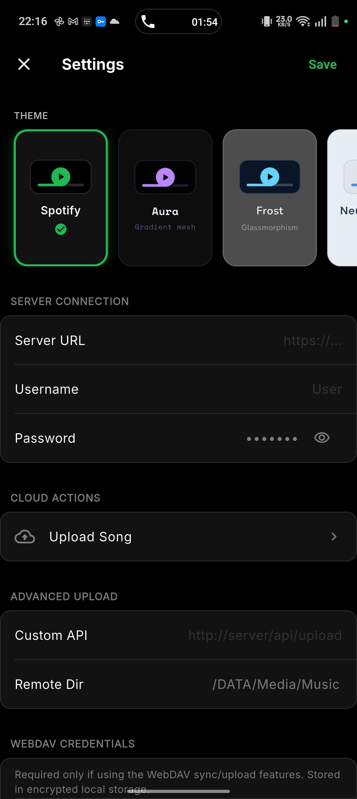

<div align="center">
  
  <h1>NaviVibe</h1>
  <p><strong>A Premium, Modern Music Client for Navidrome & Subsonic</strong></p>

  [](https://flutter.dev)
  [](https://m3.material.io)
  [](LICENSE)
</div>

---

## 🎵 Overview

NaviVibe is a state-of-the-art music player built with Flutter, designed specifically for **Navidrome**, **Gonic**, and other **Subsonic-compatible** servers. It combines a sleek, premium aesthetic with powerful features like advanced shuffle algorithms, offline caching, and real-time listening analytics.

Whether you're an audiophile looking for bit-perfect playback or a casual listener wanting a beautiful Spotify-inspired interface, NaviVibe is built for you.

## ✨ Key Features

- **🚀 High Performance**: Built with Flutter and Riverpod for smooth interactions and instant library loading.
- **🎨 Premium UI/UX**:
  - Spotify-inspired dark mode.
  - Dynamic "Fluid" mesh-gradient backgrounds that react to your music.
  - Palette extraction from cover art for a truly immersive experience.
- **🎧 Advanced Audio Engine**:
  - Powered by `just_audio` with full background playback support.
  - **Replay Gain**: Automatic volume normalization (Pre-amp, Clipping prevention).
  - **Transcoding**: On-the-fly bitrate management for Wi-Fi vs. Mobile data.
  - **Gapless Playback**: Seamless transitions between tracks.
- **🔀 Smart Shuffling**:
  - **Dithered Position Shuffle**: Optimal category spreading (Spotify-style).
  - **Weighted Lottery**: Prioritizes your favorites and highly-rated tracks.
  - **Merge-Shuffle**: Proven-optimal interleaving to avoid artist repetition.
- **💾 Offline First**:
  - Intelligent multi-layer caching (Images, Music, BPM data).
  - Persistent playlist storage with SQLite (Drift).
- **📊 Listening Intelligence**:
  - Local stats collection (Play events, song pairs, feedback signals).
  - WebDAV sync for analytics and backup.
  - Personalized recommendations based on your listening history.
- **📁 Cloud Integration**:
  - WebDAV support for remote song uploads and analytics syncing.
  - Subsonic-native starring and rating support.

## 🛠️ Tech Stack

- **Framework**: [Flutter](https://flutter.dev)
- **State Management**: [Riverpod](https://riverpod.dev)
- **Database**: [Drift](https://drift.simonbinder.eu) (SQLite) & [Hive CE](https://github.com/hivedb/hive) (KV Store)
- **Audio**: [just_audio](https://pub.dev/packages/just_audio)
- **Networking**: [http](https://pub.dev/packages/http) & [Dio](https://pub.dev/packages/dio)
- **Visuals**: Custom GLSL Shaders, Palette Generator, Google Fonts

## 🚀 Getting Started

### Prerequisites

- [Flutter SDK](https://docs.flutter.dev/get-started/install) (stable channel)
- A Subsonic-compatible server (e.g., [Navidrome](https://www.navidrome.org/))

### Installation

1. **Clone the repository**:
   ```bash
   git clone https://github.com/Subicharan1018/flutter-_navi.git
   cd flutter-_navi
   ```

2. **Install dependencies**:
   ```bash
   flutter pub get
   ```

3. **Generate code**:
   ```bash
   flutter pub run build_runner build --delete-conflicting-outputs
   ```

4. **Run the app**:
   ```bash
   flutter run
   ```

### Quick Desktop Install

- **Windows**:
  Run in PowerShell:
  ```powershell
  .\install.ps1
  ```
- **Linux**:
  Run in Terminal:
  ```bash
  ./install.sh
  ```

## 📸 Screenshots

<div align="center">
  <table>
    <tr>
      <td align="center"><br/><sub><b>Home</b></sub></td>
      <td align="center"><br/><sub><b>Library (Songs)</b></sub></td>
      <td align="center"><br/><sub><b>Library (Playlists)</b></sub></td>
    </tr>
    <tr>
      <td align="center"><br/><sub><b>Library (Albums)</b></sub></td>
      <td align="center"><br/><sub><b>Favorites</b></sub></td>
      <td align="center"><br/><sub><b>Settings</b></sub></td>
    </tr>
  </table>
</div>

## 🤝 Contributing

Contributions are welcome! Please feel free to submit a Pull Request. For major changes, please open an issue first to discuss what you would like to change.

1. Fork the Project
2. Create your Feature Branch (`git checkout -b feature/AmazingFeature`)
3. Commit your Changes (`git commit -m 'Add some AmazingFeature'`)
4. Push to the Branch (`git push origin feature/AmazingFeature`)
5. Open a Pull Request

## 📄 License

Distributed under the MIT License. See `LICENSE` for more information.

---

<div align="center">
  Made with ❤️ by Subicharan
</div>
